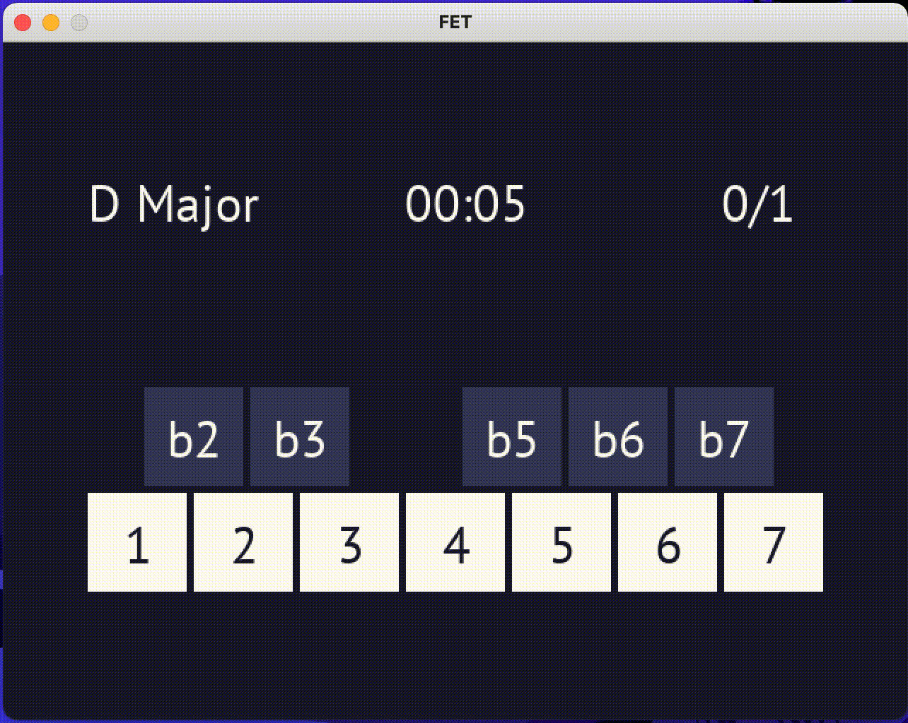

[](https://codecov.io/gh/DimitriosLisenko/fet)

# FET (Functional Ear Trainer)
This is a functional ear trainer, meaning that it teaches you to identify degrees in a key.

Every level, a chord progression is played to identify a major/minor key, followed by random notes played harmonically. The degrees of these notes should be identified and selected.



## Installation
### Prerequisites
Install TiMidity++ for required performance improvements when converting MIDI to other formats.
#### OS X
```sh
brew install timidity
```
#### Ubuntu
```sh
apt install timidity
```

Install sox for audio recording.
#### OS X
```sh
brew install sox
```
#### Ubuntu
```sh
apt install sox
```

### Gem
Add this line to your application's Gemfile:

```ruby
gem 'fet'
```

And then execute:

    $ bundle install

Or install it yourself as:

    $ gem install fet

## Usage

### Ear Training via the UI
The UI currently supports listening exercises, where a chord progression is played to establish a key, followed by notes played harmonically. The degrees of these notes should be identified by selecting them in the UI.

The binary can be executed as follows:
```sh
fet play listening --degrees 1 --key-type major --next-on-correct --tempo 200 --limit-degrees b6 --limit-degrees 5
```

All flags are optional, and serve the following purposes:

| Flag | Description |
| ------------- | ------------- |
| --degrees | How many unique degrees to play for the random notes - maximum of 11. |
| --key-type | Type of key to play, can be "major" or "minor". |
| --[no-]next-on-correct | Go to the next level automatically when answered correctly. |
| --tempo | The tempo at which the chord progression is played. |
| --limit-degrees | Limit to specific degrees. Can be supplied multiple times. |

When using the UI, the following keyboard shortcuts are defined to allow for mouse-free interaction:
| Keyboard Shortcut | Description |
| ------------- | ------------- |
| ENTER | Go to the next level once this level is over. |
| q | Quit the application. |
| c | Repeat the chord progression only. |
| n | Repeat the notes only. |
| l | Repeat the question (looping). |
| 1-7 | Select the degree, e.g. "2" selects the 2nd degree. Will also play that degree once the level is over. |
| - | Modify the above degree to flatten it, e.g. "-" followed by "2" will select the b2nd degree. |
| + | Modify the above degree to sharpen it, e.g. "+" followed by "4" will select the #4th degree. |
| 0 | Make the degree natural, e.g. "+" followed by followed by "0" followed by "4" will select the 4th degree. |

### Ear Training via MIDI files
#### Filename Format
The generators will currently create MIDI files. The correct answer is included in the filename.

#### Listening exercises
For listening exercises, here is a potential list of generated MIDI files (for 2 degrees):
```sh
$ find .
...
./listening/major/DbM_b6(Bbb2)_5(Ab5).mid
./listening/major/BbM_7(A4)_2(C6).mid
./listening/major/EM_b6(C2)_3(G#2).mid
./listening/major/GbM_6(Eb4)_3(Bb5).mid
./listening/major/FM_6(D4)_3(A5).mid
...
./listening/minor/Dm_b7(C3)_1(D4).mid
./listening/minor/F#m_b2(G2)_3(A#4).mid
./listening/minor/G#m_b6(E1)_b2(A2).mid
./listening/minor/Dm_6(B0)_7(C#3).mid
./listening/minor/C#m_5(G#4)_6(A#4).mid
...
```
The file name contains all the information required for the answer. For example, `EM_b6(C2)_3(G#2).mid`:

`EM`: the chord progression is in E Major.

`b6`: the bottom note will be the b6 degree

`(C2)`: the [scientific pitch notation](https://en.wikipedia.org/wiki/Scientific_pitch_notation) of which is C2

`3`: the next note from the bottom will be the 3 degree

`(G#2)`: the [scientific pitch notation](https://en.wikipedia.org/wiki/Scientific_pitch_notation) of which is G#2

#### Singing exercises
The singing exercises will generate all possible combinations for keys and degrees as follows:
```sh
$ find .
...
./singing/major/AM_1.mid
./singing/major/BbM_3.mid
./singing/major/CM_4.mid
./singing/major/CM_5.mid
./singing/major/BbM_2.mid
...
./singing/minor/Am_1.mid
./singing/minor/Bbm_3.mid
./singing/minor/Cm_4.mid
./singing/minor/G#m_4.mid
./singing/minor/F#m_1.mid
...
```
The file name contains all the information required for the answer. For example, `BbM_3.mid`:

`BbM`: the chord progression is in Bb Major.

`3`: you should sing the 3rd degree.

#### Single Note Listening exercises
For single note listening exercises, the same note is played across all possible keys:
```sh
$ find .
...
./listening_single_note/major/CM_1.mid
./listening_single_note/major/BM_b2.mid
./listening_single_note/major/F#M_b5.mid
...
./listening_single_note/minor/Am_b3.mid
./listening_single_note/minor/G#m_3.mid
./listening_single_note/minor/Cm_1.mid
...
```
The file name contains all the information required for the answer. For example, `G#m_3.mid`:

`G#m`: the chord progression is in G# Minor.

`3`: the note that is played is the 3rd degree in this key.

### More Information
Refer to [the rdoc](https://github.com/DimitriosLisenko/fet/blob/master/fet.rdoc) for detailed usage instructions and descriptions of commands.

## Development

After checking out the repo, run `bin/setup` to install dependencies. Then, run `rake test` to run the tests. You can also run `bin/console` for an interactive prompt that will allow you to experiment.

To install this gem onto your local machine, run `bundle exec rake install`. To release a new version, update the version number in `version.rb`, and then run `bundle exec rake release`, which will create a git tag for the version, push git commits and the created tag, and push the `.gem` file to [rubygems.org](https://rubygems.org).

## Contributing

Bug reports and pull requests are welcome on GitHub at https://github.com/DimitriosLisenko/fet.

## License

The gem is available as open source under the terms of the [MIT License](https://opensource.org/licenses/MIT).
